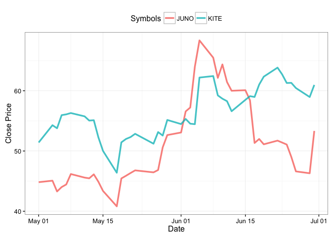
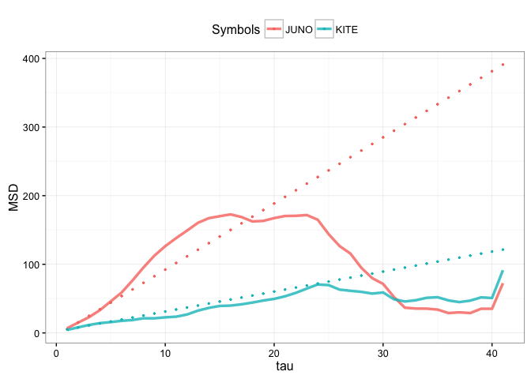
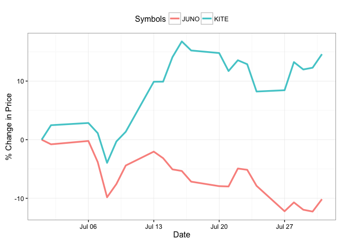

# Demo - brownian motion analysis for stock's momentum

In this example, let's look at **Juno** and **Kite**, famous CAR-T companies.

The momentum can be categorized into three groups:
1. Random (hard to predict if the price will keep moving up or down) 
2. with Momentum (if the stock price is going up, it is very likely to move higher, and vice versa)
3. Restricted (the price is very likely to slow down, not keep going up or keep going down)


```r
library(quantmod) # package for parsing stock info
```

```
## Loading required package: xts
```

```
## Loading required package: zoo
```

```
## 
## Attaching package: 'zoo'
```

```
## The following objects are masked from 'package:base':
## 
##     as.Date, as.Date.numeric
```

```
## Loading required package: TTR
```

```
## Version 0.4-0 included new data defaults. See ?getSymbols.
```

```r
library(ggplot2) 
library(gridExtra) # library for adding table to the qplot
library(reshape2)

#####################
#### User Inputs ####
#####################
sym=c("JUNO","KITE") # symbols of interest
getSymbols(sym, src="yahoo")
```

```
##     As of 0.4-0, 'getSymbols' uses env=parent.frame() and
##  auto.assign=TRUE by default.
## 
##  This  behavior  will be  phased out in 0.5-0  when the call  will
##  default to use auto.assign=FALSE. getOption("getSymbols.env") and 
##  getOptions("getSymbols.auto.assign") are now checked for alternate defaults
## 
##  This message is shown once per session and may be disabled by setting 
##  options("getSymbols.warning4.0"=FALSE). See ?getSymbols for more details.
```

```
## [1] "JUNO" "KITE"
```

```r
# assign a period you want to measure
time="20150501::20150630"
############################
#### End of User Inputs ####
############################
```

### Let's look at their prices at this given period

```r
data = lapply(1:length(sym), function(x) {
  Cl(get(sym[x])[time])
})

data[is.na(data)] <- 0 # fill the NA with 0
data = do.call(merge,c(data,all=FALSE)) # merge all the symbols and remove NA rows.  

len = length(data[,1])
indx=index(data[])

# convert data to numeric numbers
data_new = lapply(1:length(sym), function(x) {
  as.vector(data[,x],mode='numeric')
})
data_new = do.call(cbind,data_new)

data_raw = data.frame(data) # make data to dataframe
data_raw$date <- indx

colnames(data_raw) <- c(sym,"date") # close price, this is just a matrix, not a data.frame
tmp_raw=melt(data_raw,id.vars=c("date"), variable.name="Symbols", value.name="price")

p0 = ggplot(tmp_raw, aes(x=date, y=price, color=Symbols)) + 
  geom_line(size=1.2, alpha = 0.8) +
  xlab("Date") + 
  ylab("Close Price") +
  theme_bw() +
  theme(legend.position="top")
  
p0
```

<!-- -->

Both seem to go up within this two-month period. 

The question is: 

## Will they keep going up in the next few weeks?

### Let's calculate their momentum and this is also where the physics comes in!

```r
MSD_slope_dt = 5

# generate MSD values
MSD = sapply(1:(len-2), function(i) {
  if (length(sym)==1){
    temp=(data_new[(i+1):len]-data_new[1:(len-i)])^2
    mean(temp)}
  else {
  temp=(data_new[(i+1):len,]-data_new[1:(len-i),])^2
  sapply(1:length(sym), function(x) mean(temp[,x]))}
})

if (length(sym)==1){
  MSD = (c(MSD[1:(len-2)],(data_new[len]-data_new[1])^2)) # the last row of data_new, then transpose
  } else {
  MSD = t(cbind(MSD[,1:(len-2)],(data_new[len,]-data_new[1,])^2)) # the last row of data_new, then transpose
}

# generate sd for MSD values
MSD_sd = sapply(1:(len-2), function(i) {
  if (length(sym)==1){
    temp=(data_new[(i+1):len]-data_new[1:(len-i)])^2
    sd(temp)
  } else {
    temp=(data_new[(i+1):len,]-data_new[1:(len-i),])^2
    sapply(1:length(sym), function(x) sd(temp[,x]))
  }
})
if (length(sym)==1){
  MSD_sd = (c(MSD_sd[1:(len-2)],rep(0,length(sym)))) # the last row of data_new's sd, which is basically 0, then transpose
} else {
  MSD_sd = t(cbind(MSD_sd[,1:(len-2)],rep(0,length(sym)))) # the last row of data_new's sd, which is basically 0, then transpose
}

# percentage of MSD
if (length(sym)==1){
  MSD_p = MSD/max(MSD)
} else {
  MSD_p = sapply(1:length(sym), function(x) MSD[,x]/max(MSD[,x]))
}

# make data frame
tau=c(1:(len-1))
MSD=data.frame(tau=tau, MSD)
MSD_p=data.frame(tau=tau, MSD_p)
MSD_sd=data.frame(tau=tau, MSD_sd)

colnames(MSD) <- c("tau",sym)
colnames(MSD_p) <- c("tau",sym)
colnames(MSD_sd) <- c("tau",sym)

tmp_MSD=melt(MSD,id.vars=c("tau"), variable.name="Symbols", value.name="MSD")
tmp_MSD_p=melt(MSD_p,id.vars=c("tau"), variable.name="Symbols", value.name="MSD")
tmp_MSD_sd=melt(MSD_sd,id.vars=c("tau"), variable.name="Symbols", value.name="MSD_sd")

MSD_slope = sapply(2:(length(sym)+1), function(x) (lm(MSD[x][1:MSD_slope_dt,] ~ MSD[1][1:MSD_slope_dt,]))$coefficients[2][[1]])
MSD_intercept = sapply(2:(length(sym)+1), function(x) (lm(MSD[x][1:MSD_slope_dt,] ~ MSD[1][1:MSD_slope_dt,]))$coefficients[1][[1]])
MSD_fit = sapply(1:length(sym), function(x) MSD_slope[x] * MSD[1] + MSD_intercept[x])
MSD_fit = data.frame(tau,do.call(cbind,MSD_fit))
colnames(MSD_fit) = c('tau',sym)
tmp_MSD_fit=melt(MSD_fit, id.vars="tau", variable.name="Symbols", value.name='MSD_fit')

par(mfrow=c(3,1)) 
layout(1:2, heights=c(4,1))

p1 = ggplot(tmp_MSD, aes(x=tau, y=MSD, color=Symbols)) +
  geom_line(size=1.2, alpha=0.8) +
  geom_point(data=tmp_MSD_fit, aes(x=tau, y=MSD_fit, color=Symbols), size=0.5) +
  xlab("tau") + 
  ylab("MSD") +
  theme_bw() +
  theme(legend.position="top")
p1
```

<!-- -->

MSD plot and the dotted lines are **projected 'random motion' lines**

Juno's momentum line (solid line) falls below the dotted line, which means it has **restricted motion**. This means Juno's stock price may **grow slower** or even start to drop. 

Kite's momentum line is closer to the dotted line, which means Kite's stock price is **close to random**, and may **remain at the same trend** for the next few weeks.

### See if our prediction for the next few weeks is correct or not


```r
sym=c("JUNO","KITE") # symbols of interest
getSymbols(sym, src="yahoo")
```

```
## [1] "JUNO" "KITE"
```

```r
# assign a period you want to measure
time2="20150701::20150731"
# calculate the price normalized to the first data point
# it is easier to compare the delta
data2_norm = lapply(1:length(sym), function(x) {
  vars = Cl(get(sym[x])[time2])
  (vars - vars[[1]])/vars[[1]] * 100
})

data2_norm[is.na(data2_norm)] <- 0 # fill the NA with 0
data2_norm = do.call(merge,c(data2_norm,all=FALSE))

indx=index(data2_norm[])

data_raw2 = data.frame(data2_norm) # make data to dataframe
data_raw2$date <- indx

colnames(data_raw2) <- c(sym,"date") 
tmp_raw2 = melt(data_raw2,id.vars=c("date"), variable.name="Symbols", value.name="price")

p2 = ggplot(tmp_raw2, aes(x=date, y=price, color=Symbols)) + 
  geom_line(size=1.2, alpha = 0.8) +
  xlab("Date") + 
  ylab("% Change in Price") +
  theme_bw() +
  theme(legend.position="top")
  
p2
```

<!-- -->

Juon is down while Kite remains up!

#### well..this is my irresponsible analysis. Again, your call...
